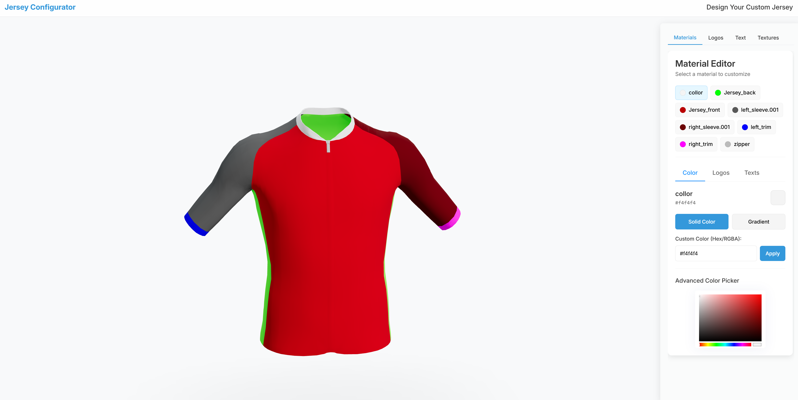

# Jersey Configurator

A modern, interactive 3D clothing configurator built with React, Three.js, and React Three Fiber. This application allows users to customize clothing items with different colors, gradients, logos, and text in a realistic 3D environment.



## Features

- **3D Model Visualization**: View and interact with 3D clothing models in real-time
- **Material Customization**:
  - Apply solid colors to different parts of the clothing
  - Create and apply custom gradients with adjustable parameters
  - Apply normal maps for realistic fabric textures
- **Logo Customization**:
  - Upload and position custom logos on the clothing
  - Adjust logo size, position, and rotation
  - Support for both front and back logos
- **Text Customization**:
  - Add custom text to the clothing
  - Choose fonts, colors, and sizes
  - Position text precisely on the model
- **Advanced Lighting**:
  - Studio-quality lighting for realistic visualization
  - Contact shadows for better grounding
- **Responsive Design**:
  - Works on desktop and mobile devices
  - Adaptive UI for different screen sizes

## Technologies Used

- **React**: Frontend UI framework
- **Vite**: Build tool and development server
- **Three.js**: 3D graphics library
- **React Three Fiber**: React renderer for Three.js
- **React Three Drei**: Useful helpers for React Three Fiber
- **Valtio**: State management
- **Tailwind CSS**: Utility-first CSS framework

## Getting Started

### Prerequisites

- Node.js (v14 or higher)
- npm or yarn

### Installation

1. Clone this repository
   ```bash
   git clone https://github.com/yourusername/3D-Clothing-Configurator.git
   cd 3D-Clothing-Configurator
   ```

2. Install dependencies
   ```bash
   npm install
   # or
   yarn install
   ```

3. Start the development server
   ```bash
   npm run dev
   # or
   yarn dev
   ```

4. Open your browser and navigate to `http://localhost:5173`

## Usage

1. **Select a Material**: Click on different parts of the clothing to select materials
2. **Change Colors**: Use the color picker to change the color of the selected material
3. **Apply Gradients**: Switch to gradient mode to create custom gradients
4. **Add Logos**: Upload and position logos on the clothing
5. **Add Text**: Add custom text with various fonts and colors
6. **Rotate View**: Click and drag to rotate the 3D model
7. **Zoom**: Use the scroll wheel to zoom in and out

## Project Structure

```
/
├── public/              # Static assets
│   ├── models/          # 3D model files
│   └── textures/        # Texture files
├── src/
│   ├── assets/          # Project assets
│   ├── canvas/          # 3D canvas components
│   │   ├── index.jsx    # Main canvas setup
│   │   ├── Shirt.jsx    # Shirt model component
│   │   └── CameraRig.jsx # Camera controls
│   ├── components/      # UI components
│   ├── config/          # Configuration files
│   ├── pages/           # Page components
│   ├── store/           # State management
│   ├── App.jsx          # Main application component
│   └── main.jsx         # Entry point
└── package.json         # Project dependencies
```

## Deployment

To build the project for production:

```bash
npm run build
# or
yarn build
```

The build artifacts will be stored in the `dist/` directory.

## Contributing

Contributions are welcome! Please feel free to submit a Pull Request.

## License

This project is licensed under the MIT License - see the LICENSE file for details.

## Acknowledgements

This project is a modified version of a repository originally created by [Mamta Gupta](https://github.com/mamtagupta). Special thanks to her for the initial implementation and inspiration.

---
If you find this project useful, please consider giving it a star ⭐. Your support is greatly appreciated!
---
